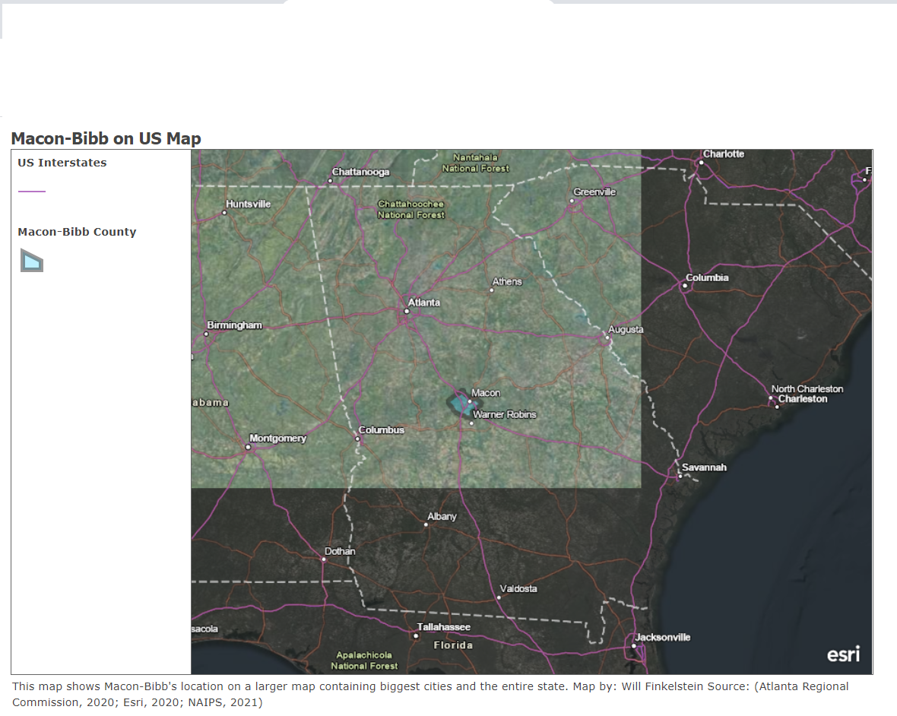
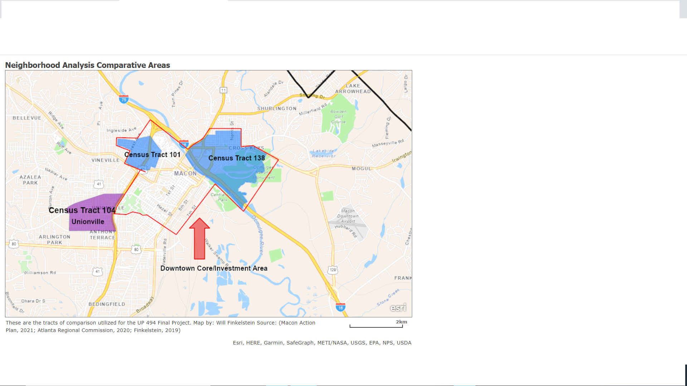
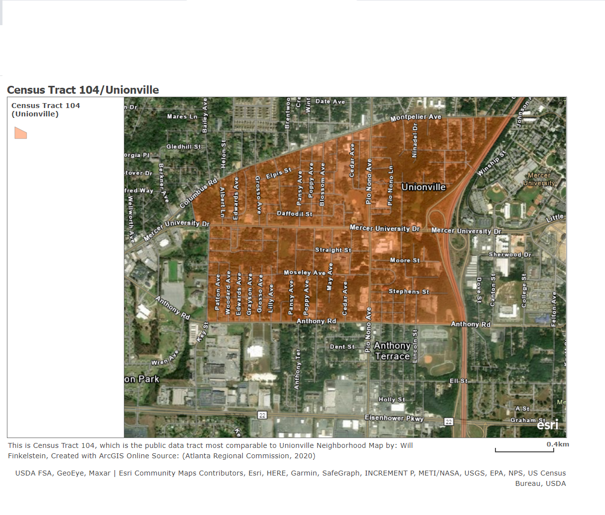

```{r setup, include = FALSE}
knitr::opts_chunk$set(echo = TRUE)
```
This RMD will provide an update of the more focused topic that will be explored, along with some preliminary context that ties or compares challenges in Unionville to those in other parts of Macon-Bibb County.

#Context and Background

Unionville is a historically black, traditionally working class neighborhood in the “near west side” of Macon. It is located just across I-75 from Mercer University. Mercer has funded a lot of real estate and foundational grant programs that spill into a few “higher-need” neighborhoods proximate to downtown, partially to permit its continued development agenda. As Unionville is just outside of that extended “downtown” area, the neighborhood is unable to access these.

Unionville has continued to transition from being a majority-homeowner community to having a declining older homeowner, mostly renter population. Children, having left long ago and having little interest in holding onto their aging parents’ homes, would sell these to any interested buyer. This trend throughout the community has enabled slumlords. Blight, illegal dumping, and high renter turnover have been constant norms. Additionally, Unionville has had a reputation for gang activity and violent crime since my early childhood. Without going too deep into specific incidents, a significant number of last year’s shootings occurred close to hear. A number of neighborhood commercial buildings have murals paying homage to community pillars who were victims of gun violence. And the Bentley & Sons Funeral Home, easily its most renowned neighborhood institution, provides free services for the families of victims as a social impact program. Yet, there are stories of unity outside of struggle also. Former Mayor C. Jack Ellis, Macon’s first and only black mayor, began his civic career as a community organizer in Unionville. The Frank Johnson Community Center, operated by Parks & Recreation, recently received around $1 million worth of renovations from SPLOST (Special Purpose Local Option Sales Tax) revenues (Dunlap, 2017). The Macon-Bibb County Government’s new Public Works and Neighborhood Cleanup Collaborations consider Unionville a major priority (Macon-Bibb County, 2021). And the neighborhood’s small, but strong business community takes a serious interest in seeing the change happen.

The remainder of this background will  discuss the spatial areas of analysis (tracts and streets), the data sources in use, the analyses that have already been and will be conducted, and the next steps for a final product. While the initial plan was to conduct further analysis on qualitative perspectives from long-term residents and neighborhood leaders, some communication challenges with organizers and other time constraints make that unfeasible at present. The expectations for how to better engage the community will be in the form of an extension, briefly described at the end.
 


```{r}
library(tidyverse)
library(tidycensus)
census_api_key("f6d3f308f00a0ffda3aa19e86807e0ea5960d86e", install = TRUE, overwrite=TRUE) 
```

# Methods and Approach

For this ongoing project, I am conducting analyses that occur at three spatial scales. One analysis occurs countywide, which evaluates the relationship between "Median Household Income" and "Proportion of Population that is Black/African American" in every census tract in Bibb County, Georgia. This is at a single point in time, but draws the picture of whether current sociodemographic data reflect trends consistent with other places.A table and dot map will be included, with each entry corresponding to a Census Tract. This is Macon-Bibb County's location compared to the rest of Georgia, with interstates and larger cities also highlighted: 
```{r}


```
There is some confusion about the light intensity, but Macon-Bibb has been considered the fourth largest community in Georgia since its 2014 consolidation. Compared to other notable major cities, Macon-Bibb is located about 80 miles southeast of Atlanta, 100 miles east of Columbus, 120 miles southwest of Augusta, 170 miles northwest of Savannah, and 90 miles southwest of Athens. 


Next, Census Tract 104, which contains almost all of Unionville and a couple of blocks of  Napier Heights neighborhood, will be compared to two other Census Tracts with similarities in sociodemographic characteristics that are included within the general area that receives investment from downtown specific programs. These are Census Tract 101, which contains all of Macon's historic Pleasant Hill neighborhood located right in the center of town, and Census Tract 138, located in east Macon and including the neighborhoods of Mill Hill, Fort Hill, and the Davis Homes Public Housing Development.Both of these border Macon's central business district. Occupancy rates and median household incomes are evaluated over a five year period (2015-19) for these three tracts, to hopefully determine if connection to downtown investment opportunities has begun to cause a revitalization.
```{r}


```
The final level of analysis occurs entirely in Census Tract 104. The plan is to evaluate a potential relationship by road between Public Works Department response times to reported property neglect and the number of crimes to occur in 2020 on each road. The strongest precedent to the work is consistent reporting that a clear majority of Macon-Bibb's record breaking 51 homicides occurred in Unionville (Hicks, 2020). The following map visualizes Census Tract 104 close up, also indicating built barriers (interstate, university) that separate this from the larger area considered downtown:
```{r}


```
The data is still in process for this. But after evaluating these at the street level, tract-wide response times to crime rates may be compared with Tracts 101 and 138 as well. 

# Data Sources
The county wide and three tract comparative analyses rely on ACS 5 year data from the US census Bureau. These include Table B19013 (Median Household Income), Table B02001 (Race), and Table DP04 (Housing Characteristics) for years 2015, 2016, 2017, 2018, 2019. After importing selected variables, values are added using mutate for certain variables such as year and percentage black.

While this data request is still in process, data for the final street by street analysis in Census Tract 104 will utilize sets imported from agencies within the combined Macon-Bibb County government. Crime data for 2020 will come from the "highly understaffed" Bibb County Sheriff's office and property neglect data will come from the county's license with "SeeClickFix". "SeeClickFix" allows residents to report instances of property neglect, lack of code enforcement, illegal dumping, and various other situations of public neglect. Complaints go into the potential scopes of eight government departments. These are Solid Waste and its privatized partner for residential trash disposal (ADS), Traffic, Recreation, Public Works, Facilities Management, Code Enforcement, Animal Services, Beautification (MaconBibb.us, 2021).

#Preliminary Analysis
While continuing to wait for local data, I went ahead and utilized Census data to contact county-wide and three tract comparisons.

After running code and plotting the relationship between "Median Household Income" and "Proportion of Population that is Black/African American" in every census tract in Bibb County, Georgia, I got the following table:
```{r}
maconbibbmhi_2019 <- get_acs(geography = "tract", state = "GA", county = "Bibb", table = "B19013", year=2019, survey="acs5", output="wide") %>%
select(NAME, B19013_001E) %>%
rename(Neighborhood = NAME, mhi = B19013_001E) 
maconbibbmhi_2019 

maconbibb_blackpopulation_2019 <-get_acs(geography = "tract", state = "GA",county = "Bibb", table = "B02001", year=2019, survey="acs5", output="wide") %>% 
rename(Neighborhood = NAME,
       pop_tot= B02001_001E,
       pop_black = B02001_003E) %>%
 select(Neighborhood, pop_tot, pop_black) %>%
 mutate(p_black = pop_black/pop_tot) %>%
 select(Neighborhood, p_black)
maconbibb_blackpopulation_2019

NeighborhoodIncomeRace <- bind_cols(maconbibbmhi_2019, maconbibb_blackpopulation_2019) %>% 
 rename(Neighborhood = Neighborhood...1) %>%
 select(Neighborhood, mhi, p_black) 
NeighborhoodIncomeRace
```
The table was then adapted into a dot plot:

```{r}
macontract_mhi_race <- ggplot(NeighborhoodIncomeRace, aes(p_black, mhi)) + geom_point(color = "blue") + 
scale_x_log10(labels = scales::percent) +
scale_y_log10(labels = scales::dollar) + 
labs(x = "Percentage Black by Census Tract", y = "Median Household Income",
     title = "Median Household Income by Proportion of Population-Black",
     subtitle =  "Ordered by Census Tract in Macon-Bibb County, Based on 2019 ACS 5 yr Estimates",
     caption = "Source: (US Census Bureau, 2020)")
macontract_mhi_race
```
With the exception of one tract, which contains Mercer University and benefits from the Census' counting of students as low income individuals, every other tract in the low income category (<$30,000 for this context) is majority black. The highest income tract, 134.10, is only 12% black. It has a median household income of $91,116. Only one majority-black tract, 136.05, out of the 25 that are over half black has a median household income over $40,000. Its median household income is $70,379. This demonstrates a high level of inequality and presumed segregation, a consistent characteristic in majority-minority communities.

A longitudinal comparison of the median household incomes in Tracts 101, 104, and 138 is tabulated with the following code:
```{r}

areasmhi19 <- get_acs(geography = "tract", state = "GA", county = "Bibb", table = "B19013", year=2019, survey="acs5", output="wide")%>%
filter(NAME %in% c("Census Tract 101, Bibb County, Georgia", "Census Tract 104, Bibb County, Georgia", "Census Tract 138, Bibb County, Georgia")) %>%
mutate(year = case_when(
  B19013_001M == "8942" ~ "2019",
  B19013_001M == "4274" ~ "2019",
  B19013_001M == "7423" ~ "2019") ) %>%
select(NAME, B19013_001E, year) %>%
rename(neighborhood = NAME, mhi = B19013_001E) 
  

areasmhi18 <- get_acs(geography = "tract", state = "GA", county = "Bibb", table = "B19013", year=2018, survey="acs5", output="wide")%>%
filter(NAME %in% c("Census Tract 101, Bibb County, Georgia", "Census Tract 104, Bibb County, Georgia", "Census Tract 138, Bibb County, Georgia")) %>%
mutate(year = case_when(
  B19013_001M == "9704" ~ "2018",
  B19013_001M == "6460" ~ "2018",
  B19013_001M == "4280" ~ "2018") ) %>%
select(NAME, B19013_001E, year) %>%
rename(neighborhood = NAME, mhi = B19013_001E) 
  

areasmhi17 <- get_acs(geography = "tract", state = "GA", county = "Bibb", table = "B19013", year=2017, survey="acs5", output="wide") %>%
filter(NAME %in% c("Census Tract 101, Bibb County, Georgia", "Census Tract 104, Bibb County, Georgia", "Census Tract 138, Bibb County, Georgia")) %>%
mutate(year = case_when(
  B19013_001M == "5841" ~ "2017",
  B19013_001M == "7934" ~ "2017",
  B19013_001M == "6285" ~ "2017") ) %>%
select(NAME, B19013_001E, year) %>%
rename(neighborhood = NAME, mhi = B19013_001E)
 

areasmhi16 <- get_acs(geography = "tract", state = "GA", county = "Bibb", table = "B19013", year=2016, survey="acs5", output="wide") %>%
filter(NAME %in% c("Census Tract 101, Bibb County, Georgia", "Census Tract 104, Bibb County, Georgia", "Census Tract 138, Bibb County, Georgia")) %>%
mutate(year = case_when(
  B19013_001M == "5466" ~ "2016",
  B19013_001M == "8125" ~ "2016",
  B19013_001M == "4597" ~ "2016") ) %>%
select(NAME, B19013_001E, year) %>%
rename(neighborhood = NAME, mhi = B19013_001E)
  

areasmhi15 <- get_acs(geography = "tract", state = "GA", county = "Bibb", table = "B19013", year=2015, survey="acs5", output="wide") %>%
filter(NAME %in% c("Census Tract 101, Bibb County, Georgia", "Census Tract 104, Bibb County, Georgia", "Census Tract 138, Bibb County, Georgia")) %>%
mutate(year = case_when(
  B19013_001M == "4935" ~ "2015",
  B19013_001M == "2629" ~ "2015",
  B19013_001M == "4138" ~ "2015") ) %>%
select(NAME, B19013_001E, year) %>%
rename(neighborhood = NAME, mhi = B19013_001E) 
 

areas5yr<- bind_rows(areasmhi15, areasmhi16, areasmhi17, areasmhi18, areasmhi19) 
areas5yr

```
And here is the accompanying line graph for the table
```{r}
lastfivemhi <- ggplot(areas5yr, aes(x = year, y = mhi, group = neighborhood)) + 
geom_line(aes(color=neighborhood)) +
geom_point(aes(color=neighborhood)) +
scale_y_log10(labels=scales::dollar)+
labs(x = "Year", y = "Median Household Income",
     title = "Median Household Income in Three Comparison Neighborhoods by Year",
     caption = "Source: (US Census Bureau: 2016-2020)")
lastfivemhi
```
According to analysis, Unionville actually experienced a higher increase in median household income. However, it is unclear if this is indication of increasing prosperity or further property investment for rental properties. A five year sample may also not provide the strongest indication of changes in area income. Another indicator surrounding housing utilization may give a stronger indication of general changes in prosperity and neighborhood health.

A longitudinal comparison of the occupancy rates in Tracts 101, 104, and 138 is tabulated with the following code:
```{r}
vacancyrate19 <- get_acs(geography = "tract", state = "GA", county = "Bibb", table = "DP04",  year=2019, survey="acs5", output="wide")%>%
filter(NAME %in% c("Census Tract 101, Bibb County, Georgia", "Census Tract 104, Bibb County, Georgia", "Census Tract 138, Bibb County, Georgia")) %>%
  mutate(year = case_when(
    DP04_0003PM == "8.4" ~ "2019",
    DP04_0003PM == "8.3" ~ "2019",
    DP04_0003PM == "7.1" ~ "2019"
  )) %>%
  rename(Neighborhood = NAME,
         Properties = DP04_0001E,
         Occupied = DP04_0002E,
         Percent_Occupied = DP04_0002PE,
         Percent_Vacant = DP04_0003PE) %>%
   select(Neighborhood, Properties, Occupied, Percent_Occupied, Percent_Vacant, year) 

vacancyrate18 <- get_acs(geography = "tract", state = "GA", county = "Bibb", table = "DP04",  year=2018, survey="acs5", output="wide")%>%
filter(NAME %in% c("Census Tract 101, Bibb County, Georgia", "Census Tract 104, Bibb County, Georgia", "Census Tract 138, Bibb County, Georgia")) %>%
  mutate(year = case_when(
    DP04_0003PM == "6.9" ~ "2018",
    DP04_0003PM == "8.3" ~ "2018",
    DP04_0003PM == "7.2" ~ "2018"
  )) %>%
  rename(Neighborhood = NAME,
         Properties = DP04_0001E,
         Occupied = DP04_0002E,
         Percent_Occupied = DP04_0002PE,
         Percent_Vacant = DP04_0003PE) %>%
   select(Neighborhood, Properties, Occupied, Percent_Occupied, Percent_Vacant, year) 

vacancyrate17 <- get_acs(geography = "tract", state = "GA", county = "Bibb", table = "DP04",  year=2017, survey="acs5", output="wide")%>%
filter(NAME %in% c("Census Tract 101, Bibb County, Georgia", "Census Tract 104, Bibb County, Georgia", "Census Tract 138, Bibb County, Georgia")) %>%
  mutate(year = case_when(
    DP04_0003PM == "8.4" ~ "2017",
    DP04_0003PM == "7.4" ~ "2017",
    DP04_0003PE == "36.4" ~ "2017"
  )) %>%
  rename(Neighborhood = NAME,
         Properties = DP04_0001E,
         Occupied = DP04_0002E,
         Percent_Occupied = DP04_0002PE,
         Percent_Vacant = DP04_0003PE) %>%
   select(Neighborhood, Properties, Occupied, Percent_Occupied, Percent_Vacant, year) 

vacancyrate16 <- get_acs(geography = "tract", state = "GA", county = "Bibb", table = "DP04",  year=2016, survey="acs5", output="wide")%>%
filter(NAME %in% c("Census Tract 101, Bibb County, Georgia", "Census Tract 104, Bibb County, Georgia", "Census Tract 138, Bibb County, Georgia")) %>%
  mutate(year = case_when(
    DP04_0003PM == "6.7" ~ "2016",
    DP04_0003PE == "34.1" ~ "2016",
    DP04_0003PM == "7.1" ~ "2016"
  )) %>%
  rename(Neighborhood = NAME,
         Properties = DP04_0001E,
         Occupied = DP04_0002E,
         Percent_Occupied = DP04_0002PE,
         Percent_Vacant = DP04_0003PE) %>%
   select(Neighborhood, Properties, Occupied, Percent_Occupied, Percent_Vacant, year) 

vacancyrate15 <- get_acs(geography = "tract", state = "GA", county = "Bibb", table = "DP04",  year=2015, survey="acs5", output="wide")%>%
filter(NAME %in% c("Census Tract 101, Bibb County, Georgia", "Census Tract 104, Bibb County, Georgia", "Census Tract 138, Bibb County, Georgia")) %>%
  mutate(year = case_when(
    DP04_0003PM == "7.3" ~ "2015",
    DP04_0003PM == "7.8" ~ "2015",
    DP04_0003PM == "6.7" ~ "2015"
  )) %>%
  rename(Neighborhood = NAME,
         Properties = DP04_0001E,
         Occupied = DP04_0002E,
         Percent_Occupied = DP04_0002PE,
         Percent_Vacant = DP04_0003PE) %>%
   select(Neighborhood, Properties, Occupied, Percent_Occupied, Percent_Vacant, year) 

vacancyrates5yr <- bind_rows(vacancyrate15, vacancyrate16, vacancyrate17, vacancyrate18, vacancyrate19)
vacancyrates5yr
```
The following graph shows the change in vacancy rate over time:

```{r}
lastfivevacancy <- ggplot(vacancyrates5yr, aes(x = year, y = Percent_Vacant, group = Neighborhood)) + 
geom_line(aes(color=Neighborhood)) +
geom_point(aes(color=Neighborhood)) +
labs(x = "Year", y = "Vacancy Rate(%)",
     title = "Vacancy Rate in Three Comparison Neighborhoods by Year",
     caption = "Source: (US Census Bureau: 2016-2020)" )
lastfivevacancy
```
Admittedly, vacancy rate is an imperfect indication of blight. But drastic declines in the other two tracts suggest the involvement of public strategies to eliminate blight, either for housing rehabilitation or demolition to increase open space. The final report will include a further discussion of the community's blight bond program, which was adopted in 2015 (Macon-Bibb County Blight Committee, 2015).

#Directions for the Future
After completing the third phase of my analysis at the street level in Census Tract 104, I will look more deeply into conclusions that can be made about the Unionville neighborhood's direction. n important part of the extension component is to create an informal engagement plan, including mock deliverables for duration, funding, and survey/interview designs.  

After the course and project experience are completed, a definite step is sharing these results with my county commissioner and a few resident organizers he plans to connect me with, along with a few other local organizers who live elsewhere but are closely connected. After hearing their thoughts and questions, I can hopefully figure out how to make some modifications that will make this an even stronger resource for a hyperlocal coalition.  


#Sources (will be cited in APA for the Final Submissions)

https://www.maconbibb.us/cleanstreetsmatter/ 

https://www.13wmaz.com/article/news/crime/macon-sees-record-breaking-number-of-homicides-in-2020/93-a3ca65b1-192e-4881-b98d-f82e106e98a4

https://www.macon.com/news/local/article141068143.html 

https://www.maconbibb.us/web-maps-for-seeclickfix/ 

https://www.boarddocs.com/ga/maconbibb/Board.nsf/files/9YQ3DC76334E/$file/Ordinance%20Amendment%20Adopt%20Budget%20Blight%20%249000000%2000.pdf

US Census Tables: DP04, B19013, B201001 for years 2015, 2016, 2017, 2018, and 2019.

Individual layers  on maps made with ArcGIS online came from layers shared in the opendata ArcGIS Online platform. Parenthetical citations are included with each.