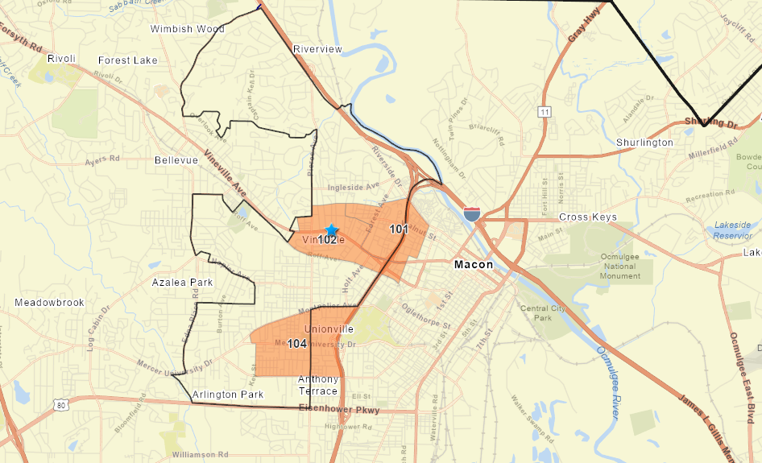
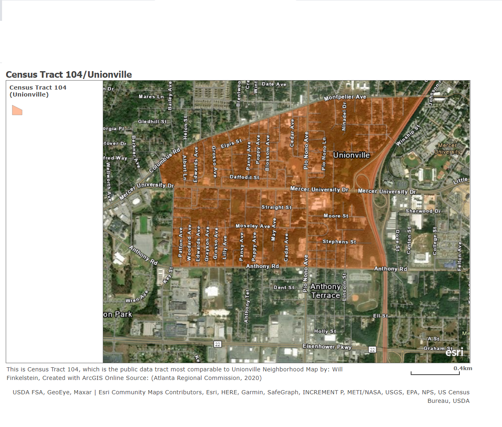

```{r setup, include = FALSE}
knitr::opts_chunk$set(echo = TRUE)
```
For my Neighborhood Analysis course this semester, I wanted to develop a data engagement framework for addressing the perennial disconnect between data sets and accessible application. While this still defines the longterm approach, the steps in this first analysis are to introduce the stories and resilience of Macon's Unionville Neighborhood, while doing some basic analyses to determine potential relationships between two major geographic data sets. The data pertain to 2020 crime statistics and the quantity and response times related to resident-filed maintenance requests, filed using the SeeClickFix application. These two sets, given at the county commission District 5 level (not the original plan, but see limitations for more!), have data pertaining to Unionville at the street level and contain information pertaining to the two major, consistently highlighted resident worries. Typical to underrepresented, majority-black neigbhorhoods, blight, dumping, and other issues of community neglect are also a major concern in Unionville. Many crime headlines, a major reputation for gang activity, and a city-county-wide police shortage also highlight the public safety fears that many residents continue to face. These analyses aim to determine if the existing data show a relationship between crime and see-click-fix requests, while also inferring what might be missing from discussions of community health. Afterwards, a brief plan for engagement and othr next stps is shared.

#Context and Background

Unionville is a historically black, traditionally working class neighborhood in the “near west side” of Macon. It is located just across I-75 from Mercer University. Mercer has funded a lot of real estate and foundational grant programs that spill into a few “higher-need” neighborhoods proximate to downtown, partially to permit its continued development agenda. As Unionville is just outside of that extended “downtown” area, the neighborhood is unable to access these.

Unionville has continued to transition from being a majority-homeowner community to having a declining older homeowner, mostly renter population. Children, having left long ago and having little interest in holding onto their aging parents’ homes, would sell these to any interested buyer. This trend throughout the community has enabled slumlords. Blight, illegal dumping, and high renter turnover have been constant norms. Additionally, Unionville has had a reputation for gang activity and violent crime since my early childhood. Without going too deep into specific incidents, a significant number of last year’s shootings occurred close to hear. A number of neighborhood commercial buildings have murals paying homage to community pillars who were victims of gun violence. And the Bentley & Sons Funeral Home, easily its most renowned neighborhood institution, provides free services for the families of victims as a social impact program. Yet, there are stories of unity outside of struggle also. Former Mayor C. Jack Ellis, Macon’s first and only black mayor, began his civic career as a community organizer in Unionville. The Frank Johnson Community Center, operated by Parks & Recreation, recently received around $1 million worth of renovations from SPLOST (Special Purpose Local Option Sales Tax) revenues (Dunlap, 2017). The Macon-Bibb County Government’s new Public Works and Neighborhood Cleanup Collaborations consider Unionville a major priority (Macon-Bibb County, 2021). And the neighborhood’s small, but strong business community takes a serious interest in seeing the change happen.

The remainder of this final  will  introduce the questions of analysis, the spatial areas of analysis (tracts and streets), the data sources in use, clear limitations, and the next steps for a final product. While the initial plan was to conduct further analysis on qualitative perspectives from long-term residents and neighborhood leaders, some communication challenges with organizers and other time constraints make that unfeasible at present. The expectations for how to better engage the community will be in the form of an extension, briefly described at the end.
 

First, we will get our R console ready: 

```{r}
 library(tidyverse)
library(tidycensus)
library(tidyr)
library(qdapRegex)
census_api_key("f6d3f308f00a0ffda3aa19e86807e0ea5960d86e", install = TRUE, overwrite=TRUE) 
 
```
#Questions Guiding Investigation
The two major questions that this analysis seeks to answer are as follows:

1. Do quantity and response time to user submitted government service requests made with SeeClickFix have any relation to crime rate? 
2. What do these variables tell us about neighborhood health?

# Methods and Approach

For this ongoing project, I am conducting analyses that occur at three spatial scales. One analysis occurs countywide, which evaluates the relationship between "Median Household Income" and "Proportion of Population that is Black/African American" in every census tract in Bibb County, Georgia. This is at a single point in time, but draws the picture of whether current sociodemographic data reflect trends consistent with other places.A table and dot map will be included, with each entry corresponding to a Census Tract. This is Macon-Bibb County's location compared to the rest of Georgia, with interstates and larger cities also highlighted:
 
There is some confusion about the light intensity, but Macon-Bibb has been considered the fourth largest community in Georgia since its 2014 consolidation. Compared to other notable major cities, Macon-Bibb is located about 80 miles southeast of Atlanta, 100 miles east of Columbus, 120 miles southwest of Augusta, 170 miles northwest of Savannah, and 90 miles southwest of Athens. 


Next, Census Tract 104, which contains almost all of Unionville and a couple of blocks of  Napier Heights neighborhood, will be compared to two other Census Tracts in the same county commission district. These are Census Tract 101, which contains all of Macon's  Pleasant Hill neighborhood located between downtown and the near-west side, and Census Tract 102, which represents the Historic Vineville Neighborhood and is located just west of Pleasant Hill and a mile north of Unionville. Prior to the construction of Interstate 75 and neighborhood physical split in the mid-20th century, Pleasant Hill was Macon's most well-to-do black neighborhood.  This neighborhood is a bit more diverse, but majority white (65%) Both of these border Macon's central business district. Occupancy rates and median household incomes are evaluated over a five year period (2015-19) for these three tracts, to hopefully determine if connection to downtown investment opportunities has begun to cause a revitalization. Tracts 101, 102, and 104 are shown below, as are the boundaries of District 5. There is a star marking my childhood home:
```{r}
 
#Map Made with ARCGIS Online
#Source: (ESRI, 2021; Atlanta Regional Commission, 2020; Nabhan, 2018)
```
You might notice that the tracts and district boundaries are not contiguous. This mismatch, contributing to two inconsistent levels of analysis, involves being given a different data set than originall requested. This will be discussed further in the limitations section below.

The final level of analysis occurs entirely in Census Tract 104. The plan is to evaluate a potential relationship by road between Public Works Department response times to reported property neglect and the number of crimes to occur in 2020 on each road. The strongest precedent to the work is consistent reporting that a clear majority of Macon-Bibb's record breaking 51 homicides occurred in Unionville (Hicks, 2020). The following map visualizes Census Tract 104 close up, also indicating built barriers (interstate, university) that separate this from the larger area considered downtown:
```{r}


```
The data is still in process for this. But after evaluating these at the street level, tract-wide response times to crime rates may be compared with Tracts 101 and 138 as well. 

# Data Sources
The county wide and three tract comparative analyses rely on ACS 5 year data from the US census Bureau. These include Table B19013 (Median Household Income), Table B02001 (Race), and Table DP04 (Housing Characteristics) for years 2015, 2016, 2017, 2018, 2019. After importing selected variables, values are added using mutate for certain variables such as year and percentage black.

Data for the final street by street analysis in Unionville utilized sets imported from agencies within the consolidated Macon-Bibb County government. Crime data for 2020 came from the "highly understaffed" Bibb County Sheriff's office and  data for SeeClickFix requests and response times came from the county's Office of Communications. "SeeClickFix" allows residents to report instances of property neglect, lack of code enforcement, illegal dumping, and various other situations of public neglect. Complaints go into the potential scopes of eight government departments. These are Solid Waste and its privatized partner for residential trash disposal (ADS), Traffic, Recreation, Public Works, Facilities Management, Code Enforcement, Animal Services, Beautification (MaconBibb.us, 2021).  

#Limitations
The following three situations represented significant limitations to the original analysis vision. These all pose important implications for future work in this context and others.


1.Data quality- It took over a month from the request date to receive the SeeClickFix and crime data and the geographic data was highly inconsistent. While the original plan had been to receive data at the tract level for Census Tracts 101, 104, and 138 (in East Macon, often considered part of the downtown core), the data I received pertained to the Macon-Bibb county commission district 5. While most of Pleasant Hill and Unionville are located in this area, parts are left out so the comparative scale is inconsistent. I am not entirely sure if this was on me for not clarifying what I needed, but it requires levels of analysis to be at different scales. In analyses where the data are strictly tract level (first part, from the Census), geographic inputs are Census Tracts 101, 102, and 104. But for the crime and SeeClickFix service requests, the data pertain to neighborhoods listed as Pleasant Hill (PH), Vineville (V), and Unionville (U). They largely cover the same areas, but the transition is imperfect.

2. Engagement Inability- While the initial undertaking was supposed to be first stage "asset-challenge inventory", my inability to reach the couple of related organizers that I knew or ability to meet others who lived here limited this. The approach I chose instead was to look at indicators that are discussed as pressing publicly, do some analyses, and proceed to take this to the community before discussing a clear course of action.

3. Imperfect variable substitution- Using response times to services requests and vacancy rates to predict the presence of blight in a neighborhood are an imperfect, and largely incomplete, approach. Yet, the lack of clear data to show the interplay between housing indicators and human impacts prevent us from having something cleaner. Like the geographic scale inconsistencies, it is worth mentioning that these have wholes but can hopefully point to similar situations that blight poses.

#Analyses 

While waiting for local data, I went ahead and utilized Census data to connect county-wide and three tract comparisons.

After running code and plotting the relationship between "Median Household Income" and "Proportion of Population that is Black/African American" in every census tract in Bibb County, Georgia, I got the following table:
```{r}
maconbibbmhi_2019 <- get_acs(geography = "tract", state = "GA", county = "Bibb", table = "B19013", year=2019, survey="acs5", output="wide") %>%
select(NAME, B19013_001E) %>%
rename(Neighborhood = NAME, mhi = B19013_001E) 
maconbibbmhi_2019 

maconbibb_blackpopulation_2019 <-get_acs(geography = "tract", state = "GA",county = "Bibb", table = "B02001", year=2019, survey="acs5", output="wide") %>% 
rename(Neighborhood = NAME,
       pop_tot= B02001_001E,
       pop_black = B02001_003E) %>%
 select(Neighborhood, pop_tot, pop_black) %>%
 mutate(p_black = pop_black/pop_tot) %>%
 select(Neighborhood, p_black)
maconbibb_blackpopulation_2019

NeighborhoodIncomeRace <- bind_cols(maconbibbmhi_2019, maconbibb_blackpopulation_2019) %>% 
 rename(Neighborhood = Neighborhood...1) %>%
 select(Neighborhood, mhi, p_black) 

```
The table was then adapted into a dot plot:

```{r}
macontract_mhi_race <- ggplot(NeighborhoodIncomeRace, aes(p_black, mhi)) + geom_point(color = "blue") + 
scale_x_log10(labels = scales::percent) +
scale_y_log10(labels = scales::dollar) + 
labs(x = "Percentage Black by Census Tract", y = "Median Household Income",
     title = "Median Household Income by Proportion of Population-Black",
     subtitle =  "Ordered by Census Tract in Macon-Bibb County, Based on 2019 ACS 5 yr Estimates",
     caption = "Source: (US Census Bureau, 2020)")

```


```{r}
NeighborhoodIncomeRace
```


```{r}
macontract_mhi_race
```


With the exception of one tract, which contains Mercer University and benefits from the Census' counting of students as low income individuals, every other tract in the low income category (<$30,000 for this context) is majority black. The highest income tract, 134.10, is only 12% black. It has a median household income of $91,116. Only one majority-black tract, 136.05, out of the 25 that are over half black has a median household income over $40,000. Its median household income is $70,379. This demonstrates a high level of inequality and presumed segregation, a consistent characteristic in majority-minority communities.

A longitudinal comparison of the median household incomes in Tracts 101, 104, and 138 is tabulated with the following code:
```{r}

areasmhi19 <- get_acs(geography = "tract", state = "GA", county = "Bibb", table = "B19013", year=2019, survey="acs5", output="wide")%>%
filter(NAME %in% c("Census Tract 101, Bibb County, Georgia", "Census Tract 104, Bibb County, Georgia", "Census Tract 102, Bibb County, Georgia")) %>%
mutate(year = case_when(
  B19013_001M == "8942" ~ "2019",
  B19013_001M == "4274" ~ "2019",
  B19013_001M == "7694" ~ "2019") ) %>%
select(NAME, B19013_001E, year) %>%
rename(neighborhood = NAME, mhi = B19013_001E) 
  

areasmhi18 <- get_acs(geography = "tract", state = "GA", county = "Bibb", table = "B19013", year=2018, survey="acs5", output="wide")%>%
filter(NAME %in% c("Census Tract 102, Bibb County, Georgia", "Census Tract 104, Bibb County, Georgia", "Census Tract 101, Bibb County, Georgia")) %>%
mutate(year = case_when(
  B19013_001M == "9704" ~ "2018",
  B19013_001M == "6460" ~ "2018",
  B19013_001M == "8050" ~ "2018") ) %>%
select(NAME, B19013_001E, year) %>%
rename(neighborhood = NAME, mhi = B19013_001E) 
  

areasmhi17 <- get_acs(geography = "tract", state = "GA", county = "Bibb", table = "B19013", year=2017, survey="acs5", output="wide") %>%
filter(NAME %in% c("Census Tract 101, Bibb County, Georgia", "Census Tract 104, Bibb County, Georgia", "Census Tract 102, Bibb County, Georgia")) %>%
mutate(year = case_when(
  B19013_001M == "5841" ~ "2017",
  B19013_001M == "7934" ~ "2017",
  B19013_001M == "5353" ~ "2017") ) %>%
select(NAME, B19013_001E, year) %>%
rename(neighborhood = NAME, mhi = B19013_001E)
 

areasmhi16 <- get_acs(geography = "tract", state = "GA", county = "Bibb", table = "B19013", year=2016, survey="acs5", output="wide") %>%
filter(NAME %in% c("Census Tract 101, Bibb County, Georgia", "Census Tract 104, Bibb County, Georgia", "Census Tract 102, Bibb County, Georgia")) %>%
mutate(year = case_when(
  B19013_001M == "5466" ~ "2016",
  B19013_001M == "8125" ~ "2016",
  B19013_001M == "3078" ~ "2016") ) %>%
select(NAME, B19013_001E, year) %>%
rename(neighborhood = NAME, mhi = B19013_001E)
  

areasmhi15 <- get_acs(geography = "tract", state = "GA", county = "Bibb", table = "B19013", year=2015, survey="acs5", output="wide") %>%
filter(NAME %in% c("Census Tract 101, Bibb County, Georgia", "Census Tract 104, Bibb County, Georgia", "Census Tract 102, Bibb County, Georgia")) %>%
mutate(year = case_when(
  B19013_001M == "4240" ~ "2015",
  B19013_001M == "2629" ~ "2015",
  B19013_001M == "4138" ~ "2015") ) %>%
select(NAME, B19013_001E, year) %>%
rename(neighborhood = NAME, mhi = B19013_001E) 
 

areas5yr<- bind_rows(areasmhi15, areasmhi16, areasmhi17, areasmhi18, areasmhi19) 


```


And here is the accompanying line graph for the table
```{r}
lastfivemhi <- ggplot(areas5yr, aes(x = year, y = mhi, group = neighborhood)) + 
geom_line(aes(color=neighborhood)) +
geom_point(aes(color=neighborhood)) +
scale_y_log10(labels=scales::dollar)+
labs(x = "Year", y = "Median Household Income",
     title = "Median Household Income in Three Comparison Neighborhoods by Year",
     caption = "Source: (US Census Bureau: 2016-2020)")

```


```{r}
areas5yr
```

```{r}
lastfivemhi
```


According to analysis, Unionville actually experienced a most consistent increase in median household income. However, it is unclear if this is indication of increasing prosperity or further property investment for rental properties. A five year sample may also not provide the strongest indication of changes in area income. Another indicator surrounding housing utilization may give a stronger indication of general changes in prosperity and neighborhood health.

A longitudinal comparison of the occupancy rates in Tracts 101, 104, and 138 is tabulated with the following code:
```{r}
vacancyrate19 <- get_acs(geography = "tract", state = "GA", county = "Bibb", table = "DP04",  year=2019, survey="acs5", output="wide")%>%
filter(NAME %in% c("Census Tract 101, Bibb County, Georgia", "Census Tract 104, Bibb County, Georgia", "Census Tract 102, Bibb County, Georgia")) %>%
  mutate(year = case_when(
    DP04_0003PM == "9.8" ~ "2019",
    DP04_0003PM == "8.3" ~ "2019",
    DP04_0003PM == "7.1" ~ "2019"
  )) %>%
  rename(Neighborhood = NAME,
         Properties = DP04_0001E,
         Occupied = DP04_0002E,
         Percent_Occupied = DP04_0002PE,
         Percent_Vacant = DP04_0003PE) %>%
   select(Neighborhood, Properties, Occupied, Percent_Occupied, Percent_Vacant, year) 

vacancyrate18 <- get_acs(geography = "tract", state = "GA", county = "Bibb", table = "DP04",  year=2018, survey="acs5", output="wide")%>%
filter(NAME %in% c("Census Tract 101, Bibb County, Georgia", "Census Tract 104, Bibb County, Georgia", "Census Tract 102, Bibb County, Georgia")) %>%
  mutate(year = case_when(
    DP04_0003PM == "6.9" ~ "2018",
    DP04_0003PM == "8.3" ~ "2018",
    DP04_0003PM == "7.7" ~ "2018"
  )) %>%
  rename(Neighborhood = NAME,
         Properties = DP04_0001E,
         Occupied = DP04_0002E,
         Percent_Occupied = DP04_0002PE,
         Percent_Vacant = DP04_0003PE) %>%
   select(Neighborhood, Properties, Occupied, Percent_Occupied, Percent_Vacant, year) 

vacancyrate17 <- get_acs(geography = "tract", state = "GA", county = "Bibb", table = "DP04",  year=2017, survey="acs5", output="wide")%>%
filter(NAME %in% c("Census Tract 101, Bibb County, Georgia", "Census Tract 104, Bibb County, Georgia", "Census Tract 102, Bibb County, Georgia")) %>%
  mutate(year = case_when(
    DP04_0003PM == "8.4" ~ "2017",
    DP04_0003PM == "7.4" ~ "2017",
    DP04_0003PM == "8.9" ~ "2017"
  )) %>%
  rename(Neighborhood = NAME,
         Properties = DP04_0001E,
         Occupied = DP04_0002E,
         Percent_Occupied = DP04_0002PE,
         Percent_Vacant = DP04_0003PE) %>%
   select(Neighborhood, Properties, Occupied, Percent_Occupied, Percent_Vacant, year) 

vacancyrate16 <- get_acs(geography = "tract", state = "GA", county = "Bibb", table = "DP04",  year=2016, survey="acs5", output="wide")%>%
filter(NAME %in% c("Census Tract 101, Bibb County, Georgia", "Census Tract 104, Bibb County, Georgia", "Census Tract 102, Bibb County, Georgia")) %>%
  mutate(year = case_when(
    DP04_0003PE == "18.9" ~ "2016",
    DP04_0003PE == "34.1" ~ "2016",
    DP04_0003PE == "43.5" ~ "2016"
  )) %>%
  rename(Neighborhood = NAME,
         Properties = DP04_0001E,
         Occupied = DP04_0002E,
         Percent_Occupied = DP04_0002PE,
         Percent_Vacant = DP04_0003PE) %>%
   select(Neighborhood, Properties, Occupied, Percent_Occupied, Percent_Vacant, year) 

vacancyrate15 <- get_acs(geography = "tract", state = "GA", county = "Bibb", table = "DP04",  year=2015, survey="acs5", output="wide")%>%
filter(NAME %in% c("Census Tract 101, Bibb County, Georgia", "Census Tract 104, Bibb County, Georgia", "Census Tract 102, Bibb County, Georgia")) %>%
  mutate(year = case_when(
    DP04_0003PM == "7.3" ~ "2015",
    DP04_0003PM == "7.8" ~ "2015",
    DP04_0003PM == "8.4" ~ "2015"
  )) %>%
  rename(Neighborhood = NAME,
         Properties = DP04_0001E,
         Occupied = DP04_0002E,
         Percent_Occupied = DP04_0002PE,
         Percent_Vacant = DP04_0003PE) %>%
   select(Neighborhood, Properties, Occupied, Percent_Occupied, Percent_Vacant, year) 

vacancyrates5yr <- bind_rows(vacancyrate15, vacancyrate16, vacancyrate17, vacancyrate18, vacancyrate19)

```
The following graph shows the change in vacancy rate over time:

```{r}
lastfivevacancy <- ggplot(vacancyrates5yr, aes(x = year, y = Percent_Vacant, group = Neighborhood)) + 
geom_line(aes(color=Neighborhood)) +
geom_point(aes(color=Neighborhood)) +
labs(x = "Year", y = "Vacancy Rate(%)",
     title = "Vacancy Rate in Three Comparison Neighborhoods by Year",
     caption = "Source: (US Census Bureau: 2016-2020)" )

```
```{r}
vacancyrates5yr
```


```{r}
lastfivevacancy
```


Admittedly, vacancy rate is an imperfect indication of blight. But drastic declines in Pleasant Hill's vacancy rate. back up the involvement of public strategies to eliminate blight, either for housing rehabilitation or demolition to increase open space. These include a growing blight bond project and an effort funded by the Georgia Department of Transportation to relocate and rebuild homes demolished by their Interstate 25 expansion. Census Tract 102, Vineville, has increasing vacancy rate likely pertaining to incresed rental properties and an increasing number of unoccupied, historic homes on the busy main road. And Vineville still has around 30% less of the vacancy that Unionville has.
```{r}
#Loading
d5crime <- (read.csv("MACON-BIBB COMMMISION DISTRICT 5_crime.csv"))
SCFd5<-(read.csv("District 5 info_seeclickfix.csv"))
MostImportantComplaints <- (read.csv("District 5 narroweddown_seeclickfix.csv"))
```


# Crime In District 5 and Select Neighborhoods

This first hyper local comparison involves looking at the reported crime rates for 2020 in each neighborhood as a percentage of the District 5 total. Below are a table and graph representing the following:

1. Unionville, Pleasant Hill, and Vineville's percentages of the total crime rate for District 5
2. The proportion of each reported crime type to the whole in Unionville, Pleasant Hill, and Vineville
3. Streets and intersections in Unionville With Over Three Reported Events.

First, here is the code pertaining to the crime tables and graphs:


```{r}
d5crime <- d5crime %>% 
  select(ï..Address, IncidentÂ.Type, Neighborhood) %>%
  rename(Address = ï..Address, Type= IncidentÂ.Type) %>% 
  mutate(StreetName = rm_number(Address))
   
d5neighborhood <- d5crime %>%
  filter(Neighborhood %in% c("U", "PH", "V")) %>%
  group_by(Neighborhood) %>%
  summarise(Total = n())

neighborhoodscrime <- d5neighborhood %>%
  mutate(District = 686,
         Proportion = (Total/District),
         District = as.integer(District),
        Proportion = (round(Proportion, digits = 3)) ) %>%
  select(Neighborhood, Total, Proportion)  
  
    
crimebytype <- d5crime %>%
  group_by(Type) %>%
  summarise(Total = n(),
            District = 686,
            Proportion = (Total/District)) %>%
   mutate(District = as.integer(District),
          Proportion = as.integer(Proportion))

neighborhoodtypes <- d5crime %>%
  group_by(Neighborhood, Type) %>%
  filter(Neighborhood %in% c("U", "PH", "V")) %>%
  summarise(Total = n())

crimebyneighborhood <- neighborhoodtypes %>%
  pivot_wider(names_from = Neighborhood, values_from = Total) %>%
 replace_na(list(PH = 0, V = 0, U = 0))

percentcalcs <- left_join(crimebyneighborhood, crimebytype) %>%
  select(Type, U, PH, V, Total) %>%
  mutate(UProportion = U/Total,
         PHProportion = PH/Total,
         VProportion = V/Total)%>%
  mutate_at(6:8, round, 3)

ProportionbyNeighborhood <- percentcalcs %>%
  select(Type, UProportion, PHProportion, VProportion, Total) %>%
  rename(PH = PHProportion,
         U = UProportion,
         V = VProportion)

ProportionNeighborhoodLonger <- ProportionbyNeighborhood %>%
  pivot_longer(c("PH", "U", "V"), names_to = "Neighborhood", values_to = "Proportion") %>%
  mutate(Cases = Proportion * Total,
         Cases = round(Cases, digits = 0), 
        Proportion = round(Proportion, digits = 0),
        Total = case_when(
  Neighborhood == "V" ~ "45",
  Neighborhood == "U" ~ "87",
  Neighborhood == "PH" ~ "69"),
       Total = as.integer(Total),
       Proportion = Cases/Total,
       Proportion = round(Proportion, digits = 3)) %>%
  select(Type, Neighborhood, Proportion)


crimebyStreetU <- d5crime %>%
  filter(Neighborhood == "U") %>%
  group_by(StreetName) %>%
  summarise(Total = n()) %>%
  filter(Total  >= 3) %>%
  select(StreetName, Total) 
 
```


```{r}
neighbarhoods <- ggplot(neighborhoodscrime, mapping = aes(x = Neighborhood, y = Proportion)) + geom_bar(mapping = aes(fill = Neighborhood), stat='identity')  +
scale_y_continuous(labels = scales::percent, breaks = c(.02, .04, .06, .08, .10, .12, .14, .16, .18, .20)) +
  labs(x = "Neighborhood", y = "Proportion of Crime (%)",
     title = "Proportion of District 5 Crime Rate, 2020",
     subtitle = "Unionville, Vineville, and Pleasant Hill Neighborhoods",
     caption = "Source: (Bibb County Sheriff's Department, 2021 )") +
  annotate(geom = "text", x = "V", y = .12,
           label =       
           "These neighborhoods had 
           201 cases, 29.3% of 
           the District 5 total", 
           size = 3,
           fontface = 'italic')

CrimeStack <- ggplot(ProportionNeighborhoodLonger,  mapping = aes(x = Neighborhood, fill = Type)) + 
  geom_bar(aes(y = Proportion), position = "fill", stat = "identity") +
  labs(x = "Neighborhood", y = "Proportion",
     title = "Neighborhood Crimes by Type, 2020",
     subtitle = "Unionville, Vineville, & Pleasant Hill Neighborhoods",
     caption = "Source: (Bibb County Sheriff's Department, 2021 )") 

UStreetBar <- ggplot(crimebyStreetU, mapping = aes(x = Total, y = StreetName)) + 
  geom_bar(mapping = aes(fill = StreetName), stat='identity')  +
  scale_x_continuous(breaks = c(2, 4, 6, 8, 10, 12, 14, 16, 18, 20)) +
  labs(x = "Reported Crimes", y = "Unionville Street or Intersection",
     title = "Unionville Streets/Corners With Most Reported Crimes",
     subtitle = "Included if Street/Intersection had >= 3 incidents in 2020",
     caption = "Source: (Bibb County Sheriff's Department, 2021 )") 
  


 

```

#Total in Each Neighborhood And Percentage of District 5 Total
```{r}

neighborhoodscrime
```


```{r}
neighbarhoods
```
Out of these three, Unionville  has the highest crime rate. It is just under twice the rate of Vineville and about 20% higher than Pleasant Hill.  

#Proportion of D5 Crime by Type in Each Neighborhood #

This table shows each neighborhood's proportion by crime to the district's total. 
```{r}
ProportionbyNeighborhood

```
Crucial Observations are that Unionville had just under 30% of the District's total homicide rate (2 out of 7) and also the highest rates of Aggravated Assault, Auto Theft, Street Robbery, Commercial Burglary, and Commercial Robbery in this three neighborhood comparison. Pleasant Hill had 4 of the Districts 12 total arson cases, a crime that neither Unionville nor Vineville had any reported cases of. 


But in the following stacked bar chart, each neighborhood's proportion for each crime type is listed as a porportion of the neighborhood's total crime rate rather than to the District's Totals for each Incident

```{r}
CrimeStack
```
As seen above, auto theft, aggravated assault, and entering automobile all make up larger parts of Unionville's crime rate. But Unionville also has more variety and instances of all but 1 crime type. Pleasant Hill has large proportions for aggravated assault and residential burglary, while Vineville's one major category, making up more than half of its total cases, is "entering automobile".

# Crime Events by Street in Unionville
For the sake of a comparison of streets with high crime and high rates of blight/property neglect (indicated through SeeClickFix records), this section identifies roads and/or intersections that had at least 3 reported crimes in 2020.

```{r}
crimebyStreetU

```
```{r}
UStreetBar
```
Pio Nono Ave, Montpelier Ave, and Mercer University Dr are all busy main roads. Montpelier becomes Columbus, so out of the exclusively residential streets, Cedar Ave has the highest proportion with twice as many reported crimes as the other three primarily residential streets (Poppy, Woodard, and Blossom) have. "Pio Nono/Montpelier" is a separate category do to the challenges of assigning this to one road. But this is the major commercial intersection at the beginning of Unionville, so unsurprising to have multiple events.


# SeeClickFix Requests and AVerage Response Times

This second hyper local comparison involves looking at requests for government services/interventions or complaints on issues in each neighborhood. Below are tables and graphs representing the following:

1. Total number of requests in Unionville, Pleasant Hill, and Vineville 
2. Average number of days before a request is archived or solved, from cases that have been archived or solved
3. Percentage of cases that are solved and unsolved (listed as open or acknowledged) in each neighborhood
4. Streets and intersections in Unionville With Over Three Requests.

First, it is necessary to cut the table from over 2,000 requests for District 5 to around 800 pertaining to these three neighborhoods. Here is the code pertaining to the requests tables and graphs:

```{r}
 
SCFd5 <- SCFd5 %>% 
rename("Neighborhood" = ï..Neighborhood, "Opened" = Created.at.Local, "Closed" = Closed.at.Local) %>%
  filter(Neighborhood %in% c("U", "PH", "V")) %>%
  select(Neighborhood, Status, Summary, Address, Opened, Closed, Time) %>%
  group_by(Neighborhood) %>%
  mutate(StreetName = rm_number(Address)) 

IncompleteCases <- SCFd5 %>%
  filter(Status %in% c("Acknowledged", "Open")) %>%
  group_by(Neighborhood) %>%
  summarise(Incomplete = n())
  

forscfcalcs <- SCFd5 %>%
  filter(Status == "Archived") %>%
  select(Neighborhood, Time) %>%
  mutate(Time = as.numeric(Time)) %>%
  group_by(Neighborhood) %>%
  summarise(Time = mean(Time, na.rm = FALSE))

seeclicklump <- SCFd5 %>%
  group_by(Neighborhood) %>%
  summarise(Complaints = n()) 

seeclicklump <-  left_join(seeclicklump, IncompleteCases)  %>%
  mutate(Solved = (Complaints-Incomplete)/Complaints)  


seeclicklump <-  left_join(seeclicklump, forscfcalcs) %>%
  mutate(Unsolved = 1 - Solved)

avgresponseneighborhood <- seeclicklump %>%
  select(Neighborhood, Complaints, Time)

seeclicklump <- seeclicklump  %>%
  select(Neighborhood, Solved, Unsolved)

 seeclicklumplong <- seeclicklump %>%
  pivot_longer(c(Solved, Unsolved), names_to = "Status", values_to = "Proportion")

ComplaintbyStreet <- SCFd5 %>%
  filter(Neighborhood == "U") %>%
  group_by(StreetName) %>%
  summarise(Total = n()) %>%
  filter(Total >= 3) %>%
  select(StreetName, Total)

 


 


 
  
```


```{r}
solvedbyneighborhood <- ggplot(data = seeclicklumplong, mapping = aes(x = Neighborhood, fill = Status))+
 geom_bar(mapping = aes( y = Proportion), position = "fill", stat='identity')  + 
  scale_y_continuous(
   labels = scales::percent, 
      breaks = c(.05,.10, .15, .2, .25, .5, .75, 1))  +
  labs(x = "Neighborhood", y = "Percentage Solved",
     title = "SeeClickFix- Status of Requests by Neighborhood",
     subtitle = "Requests from 2020, Solved = Archived, Unsolved = Open or Acknowledged" ,
     caption = "Source: (Macon-Bibb County Office of Communications, 2021 )" ) 


 

totalrequests <- ggplot(data= avgresponseneighborhood, mapping = aes(x = Neighborhood, y = Complaints, color = Neighborhood)) +
  geom_bar(mapping = aes( fill = Neighborhood), stat = "identity") + scale_y_continuous(breaks = c(100,150, 200, 300, 400, 450, 500)) +
  labs(x = "Neighborhood", y = "User Submitted Requests",
     title = "See Click Fix- Requests by Neighborhood",
     subtitle = "Requests Relating to Any Necessary Services, January 2020- Present" ,
     caption = "Source: (Macon-Bibb County Office of Communications, 2021 )") 
  
 
 
  
 
 ResponseTimeAverage <- ggplot(data= avgresponseneighborhood, mapping = aes(x = Neighborhood, y = Time, color = Neighborhood)) +
  geom_bar(mapping = aes( fill = Neighborhood), stat = "identity") + scale_y_continuous(breaks = c(5, 10, 15, 20, 25, 30, 35, 40)) +
  labs(x = "Neighborhood", y = "Average Time Open (days)",
     title = "See Click Fix Response Period",
     subtitle = "Average Number of Days Between Request Submission and Archival" ,
     caption = "Source: (Macon-Bibb County Office of Communications, 2021 )") 
 
 
UStreetComplaints <- ggplot(ComplaintbyStreet, mapping = aes(x = Total, y = StreetName)) + geom_bar(mapping = aes(fill = StreetName), stat='identity')  + scale_x_continuous(breaks = c(2, 4, 6, 8, 10, 12, 14, 16, 18, 20)) +
   theme(legend.position = "none") +
  labs(x = "Requests by Street", y = "Street in Unionville",
     title = "Unionville Streets With Most SeeClickFix Requests",
     subtitle = "Included if Street/Intersection had >= 3 Requests in 2020",
     caption = "Source: (Macon-Bibb County Office of Communications, 2021 )")  
 
```


#Total Number of Complaints and Average Response Time

The following table and next two graphs show the total number of complaints/service requests filed in 2020 and the average response/completion time (in days) for requests. For this comparison, the requests become completed after they are archived.


```{r}
avgresponseneighborhood
```


```{r}
totalrequests
```
Vineville residents created the most requests by a longshot. This is unsurprising, considering the presence of the city's most active neighborhood organization. Unionville does not have an active neighborhood organization so is considered part of a larger one pertaining to several " near Westside" neighborhoods. Pleasant Hill's is still pretty new. 
```{r}
ResponseTimeAverage
```
Vineville also had the longest average response time to requests. This could be due to the overall volume of requests filled in Vineville, or a possible attempt to solve these requests more thoroughly. Unionville has the shortest average response time at ~29 days, but a request being archived can also occur after assigned personnel do what is feasible. Sometimes the only feasible move is saying that something is out of their control.

#Percentage Solved/Archived in Each Neighborhood
The next table and graph show the percentage of requests that have been archived or completed in each area. Archived and solved are not synonymous, but this analysis is more interested in showing government's energy and attention to neighborhoods rather than fixing problems that occured over a gradual period.

```{r}
seeclicklump

```


```{r}
solvedbyneighborhood
```
Unionville has the highest percentage of complaints solved. Again, it is unclear if archiving a case really means the issue has been fixed. Unionville also has more main thoroughfares than Pleasant Hill and Vineville have, so requests that refer to these roads may get answered more quickly.

#Number of Cases by Street
This section lists the roads in Unionville that had at least 3 service requests. Requests by street do not separate multiple ones referring to the same property.

```{r}
ComplaintbyStreet
```
```{r}
UStreetComplaints
```
Grosso Ave had many complaints pertaining to the same property (Macon-Bibb County Office of Communications, 2021). Pansy and Poppy are mentioned regularly as roads with high frequencies of illegal dumping. This set only includes two roads, Poppy and Columbus, that are in the highest crime categories.

# SeeClickFix Requests and AVerage Response Times For "Crucial Requests"

Out of the over 100 different request "summaries" found in the District 5 table, I narrowed the set down to 27 "crucial" request categories. These categories can be clearly traced to tasks performed by four governmental departments that should be instrumental in mitigating blight, illegal dumping, and other instances of property or community neglect that consistently afflict under served, majority black neighborhoods. The summaries in the crucial request category are as follows:

"Code Enforcement: Abandoned/ Inoperable/Junk Cars or Vehicles",
"Code Enforcement: Burned House",
"Code Enforcement: COMMERCIAL",
"Code Enforcement: Home Repair Exterior",
"Code Enforcement: Code Enforcement: Vacant\Abandoned\Dilapidated ",
"Code Enforcement: Yards\Premises OR Vacant lot",
"PROPERTY MAINT - Abandoned/ Inoperable/Junk Cars or Vehicles",
"PROPERTY MAINT - Burned House",
"PROPERTY MAINT - COMMERCIAL",
"PROPERTY MAINT - Vacant\Abandoned\Dilapidated",
"PROPERTY MAINT - Yards\Premises OR Vacant lot",
"Public Works: Alley - needs cleaning",
"Public Works: Pot hole",
"Public Works: Litter",
"Public Works: Alley -Scrape Add Crush & Run",
"Public Works: Clean Macon Bibb Owned Property",
"Public Works: Sidewalk",
"Public Works: Cut Right-Of-Way",
"Public Works: Barrels/Cones",
"Public Works: Streets",
"S-WASTE: Animal - Dead Pickup Request",
"S-WASTE: Debris | Limbs | Yard Clippings | Bulky Waste",
"S-WASTE: Downtown Garbage/Recycling Carts",
"S-WASTE: Eviction Debris",
"S-WASTE: Furniture/Appliances",
"S-WASTE: Illegal dumping",
"S-WASTE: Tires"

The same analyses from the full set of requests are performed below for this 27 category summary.
First, the code:

```{r}
MostImportantComplaints <- MostImportantComplaints %>% 
rename("Neighborhood" = ï..Neighborhood, "Opened" = Created.at.Local, "Closed" = Closed.at.Local, "Time" = Time.Elapsed) %>%
  filter(Neighborhood %in% c("U", "PH", "V")) %>%
  select(Neighborhood, Status, Summary, Address, Opened, Closed, Time) %>%
  group_by(Neighborhood) %>%
  mutate(StreetName = rm_number(Address))

 
   UnsolvedSelect <- MostImportantComplaints %>%
  filter(Status %in% c("Acknowledged", "Open")) %>%
  group_by(Neighborhood) %>%
  summarise(Incomplete = n())
  
selectclicklump <- MostImportantComplaints %>%
  group_by(Neighborhood) %>%
  summarise(Complaints = n())

selectcaseaverages <- MostImportantComplaints %>%
  filter(Status == "Archived") %>%
  select(Neighborhood, Time) %>%
  mutate(Time = as.numeric(Time)) %>%
  group_by(Neighborhood) %>%
  summarise(Time = mean(Time, na.rm = FALSE))
 

selectclicklump <- left_join(selectclicklump, UnsolvedSelect) %>%
  mutate(Solved = (Complaints-Incomplete)/Complaints)


 selectclicklump <-left_join(selectclicklump, selectcaseaverages) %>%
    mutate(Unsolved = 1 - Solved) 
 
 avgresponsedire <- selectclicklump %>%
  select(Neighborhood, Complaints, Incomplete, Time)

selectclicklump<- selectclicklump %>%
  select(Neighborhood, Solved, Unsolved)


selectclicklumplong <- selectclicklump %>%
  pivot_longer(c(Solved, Unsolved), names_to = "Status", values_to = "Proportion")


  
SCFUbystreet <- MostImportantComplaints %>%
  filter(Neighborhood == "U") %>%
  group_by(StreetName)%>%
  summarise(Total = n()) %>%
  filter(Total >= 2) %>%
  select(StreetName, Total)
 
```

```{r}
solveddireneighborhood <- ggplot(data = selectclicklumplong, mapping = aes(x = Neighborhood, fill = Status))+
 geom_bar(mapping = aes( y = Proportion), position = "fill", stat='identity')  + 
  scale_y_continuous(
   labels = scales::percent, 
      breaks = c(.05,.10, .15, .2, .25, .5, .75, 1))  +
  labs(x = "Neighborhood", y = "Percentage Solved",
     title = "SeeClickFix- Status of Crucial Requests by Neighborhood",
     subtitle = "Requests from 2020, Solved = Archived, Unsolved = Open or Acknowledged" ,
     caption = "Source: (Macon-Bibb County Office of Communications, 2021 )" ) 


totaldire <- ggplot(data= avgresponsedire, mapping = aes(x = Neighborhood, y = Complaints, color = Neighborhood)) +
  geom_bar(mapping = aes( fill = Neighborhood), stat = "identity") + scale_y_continuous(breaks = c(15, 30, 45, 60, 75, 90, 105, 120, 135, 150, 165)) +
  labs(x = "Neighborhood", y = "User Submitted Requests",
     title = "SeeClickFix- Crucial Requests by Neighborhood",
     subtitle = "Requests Relating to Crucial Services, 2020" ,
     caption = "Source: (Macon-Bibb County Office of Communications, 2021 )") 
  
 
 AverageResponseforDire <- ggplot(data= avgresponsedire, mapping = aes(x = Neighborhood, y = Time, color = Neighborhood)) +
  geom_bar(mapping = aes( fill = Neighborhood), stat = "identity") + scale_y_continuous(breaks = c(5, 10, 15, 20, 25, 30, 35, 40, 45, 50, 55)) +
  labs(x = "Neighborhood", y = "Average Time Open (days)",
     title = "SeeClickFix Response Period- Crucial Requests",
     subtitle = "Average Number of Days Between Submission and Archival" ,
     caption = "Source: (Macon-Bibb County Office of communications, 2021 )") 
 
  
  UStreetDire <- ggplot(SCFUbystreet, mapping = aes(x = Total, y = StreetName)) + geom_bar(mapping = aes(fill = StreetName), stat='identity')  + scale_x_continuous(breaks = c(2, 4, 6, 8, 10, 12, 14, 16)) +
   theme(legend.position = "none") +
  labs(x = "Requests by Street", y = "Street in Unionville",
     title = "Unionville Streets With Most 'Crucial' SeeClickFix Requests",
     subtitle = "Included if Street/Intersection had >= 2 Crucial Requests in 2020",
     caption = "Source: (Macon-Bibb County Office of Communications, 2021 )") 
 
 
 
 
```
# Percentage Solved

For these most crucial requests, the following table and graph show the percentage solved in each neighborhood.

```{r}
 selectclicklump
```


```{r}
solveddireneighborhood
```
This time, the more affluent and better organized Vineville neighborhood has the highest proportion of archived cases. Unionville still has a much higher percentage than Pleasant Hill.

#Number of Requests And Average Response Time
These next two graphs show the total number of Requests/Complaints in this crucial requests category  and the average number of days before completion/archival:

```{r}

avgresponsedire

```


```{r}
totaldire
```
Like the combined request set, Vineville has the most submitted requests and Unionville has the fewest.

```{r}
AverageResponseforDire
```
For archived/completed requests, Pleasant Hill and Unionville have similar durations (around 35 days) while Vineville's is much longer (over 50). But when considering that Vineville has the highest percentage of archived requests as well, this could be indicative of a further attempt to do whatever is feasible to mitigate these issues before closing a case.


#Crucial Requests by Road

Due to a smaller sample, this comparison includes any road that has over 2 cases rather than 3 for the other two analyses.

```{r}
SCFUbystreet
```


```{r}
UStreetDire
```
Again, Grosso has the highest number of requests that mostly pertain to one property (Macon-Bibb County Office of Communications, 2021). Pansy Ave also has several requests, which is unsurprising when considering how often the street is mentioned as a hot spot for illegal dumping (Helm, 2021).  

#Synthesis of Findings
After looking at these three analyses, it can be difficult to draw any thorough connection between crime rates, response times to See Click Fix requests, and the number of instances based on requests. If anything, this small sample suggests that a higher crime rate accompanies fewer See-Click-Fix requests. And fewer requests does not mean that blight/property neglect are less of an issue in Unionville. If anything, issues that might warrant a SeeClickFix requests may be such a norm that residents have no reason to expect different. The local government may be so detached from Unionville that residents might not know that the application exists, have the technology necessary to access the application, or the technical literacy to know how to make a request. Again, with less clarity on the percentage of service needs that receive a request, it is hard to tell how blight, dumping, and other situations of community neglect relate to the streets with highest crime. 

While the data analyses largely reflect narratives that places like Unionville face, as being underserved/underrepresented and having challenges that are caused by this, chronically high poverty rates, and other residual effects of redlining, few conclusions can be drawn by looking at these data sets. More new questions are raised  by this study than answers. 

#Conclusions- New Questions, Introduction of the Future Engagement Priorities
To quickly visit the two questions we initially posed:
1. Is there a noticeable relationship between service requests and response times to Macon-Bibb County government and crime rates for 2020?
2. What do these variables tell us about community health?

In this set, higher crime rate neighborhoods have fewer service requests. This seems to indicate lack of engagement more than any observation of rates of blight, illegal dumping property neglect. And it feels unfair and impossible to make any further conclusions about community health from the presented data. Doing so without speaking to residents would be problematic and must be avoided. And speaking to residents with the intent of getting a specific response would be bad too. When considering what has been found here, the following recommendations arise for future analysis and engagement:

1. Ask residents to share their experiences with crime and property neglects.

2. Engage with resident organizers on a regular basis, plan with not at. Promote community ownership of these analyses, only using them for further work or certain types of implementation with neighborhood permission. 

3. Find ways to create awareness on SeeClickFix's capabilities, instruct on how to use, and look into engagement alternatives for residents who cannot feasibly use SeeClickFix. 

4. Explore ways to put part of Macon-Bibb's federal stimulus funding allocation towards better data collection capabilities or more data collection personnel in local departments.

5. If encouraged by neighborhood, monitor and analyze property neglect/illegal dumping activity on each street, beginning with ones that had multiple service requests for crucial activities.
***If effective in building coalition and helping residents reach better neighborhood outcomes, explore bringing this to another neighborhood like Pleasant Hill or the bordering Bartlett Crossing. 

#Epilogue- Next Steps and Community Engagement
  

After the course and project experience are completed, a definite step is sharing these results with my county commissioner and a few resident organizers he plans to connect me with, along with a few other local organizers who live elsewhere but are closely connected. After hearing their thoughts and questions, I can hopefully figure out how to make some modifications that will make this an even stronger resource for a hyperlocal coalition.  

After these meetings occur, the clear next step would be creating a further engagement plan. The process should not be pursued until meetings with the hypothetical coalition begin, but I will propose a hypothetical.

This should involve a straightforward, quick survey mailed and  a series of conversations held at a community dinner, public health safety permitting. The dinner should be provided by a local restaurant (like Montpelier Ave's Fish Port) or a neighborhood pillar who can cook for a large audience while being well-compensated. This will be in an evening or at a time on the weekend that works with people's schedules, rather than at lunch on a weekday like other meetings have been. After the conversations occur, data will be analyzed and taken back to the coalition. This coalition should develop a next step, actionable plan with agreed to responsibilities falling on the local government, resident organizers, and philanthropic partners. In no more than a month after these conversations, the coalition will hold another community meal to share the results and proposed course of action. A clear channel of communication will be formed between residents and the coalition to ensure that proposed actions go in line with shared desires. Actionable steps should begin on an agreed to date within the next month following the second community meal.

A mock survey and conversation are included here:


1. How long have you lived in Unionville? ____
 
2. What is your favorite thing about living in Unionville? ____

3. What do you see as its biggest challenges?_______
 
The next three questions (4-6) are ordinal and responses pertain to the following
1 Disagree Almost Always
2 Disagree Some
3 Neutral/No Opinion
4 Agree Some
5 Agree Almost Always
* Neutral/No Opinion

4. I feel safe in Unionville
1  2  3  4  5  *

5. I feel a sense of community here
1  2  3  4  5  *

6. I trust that Macon-Bibb County government can help me when I request it

1  2  3  4  5  *

**The purpose of this survey is to begin a conversation about a government and grassroots community collaboration for addressing neighborhood challenges. Would you be interested in attending an upcoming neighborhood dinner to discuss some of these issues?  Y/N

If yes, will you include an a method for contacting you?  _________________

Do you have any questions for us? You can add these below or give us a call at 
478-714-9247. Be on the look out for next steps! 


Conversation Questions

The following will be asked in small groups or one on one settings, based on the number of data collectors. These should be compensated residents who have been highlighted by organizers and interested in becoming a part of this process.

1. What do you tell people when they ask about Unionville?

2. What are things that you seen as major challenges?

3. (Based on the response) Please tell me more about what you see.

4. How do these events make you feel?

5. Do you have any ideas for what can make Unionville greater?

6. How can or should the local government be a partner for future community work?

7. Do you have anything you would like to add or ask us?

#Sources  

Macon-Bibb County Office of Communications. (2021). Clean Streets Matter- Street Cleaning, Community Beautification. Macon-Bibb County Government. https://www.maconbibb.us/cleanstreetsmatter/ 

Hicks, T. (31 December, 2020). 'It's been a very troubling year for us': Macon sees record breaking number of homicides in 2020. 13WMAZ. https://www.13wmaz.com/article/news/crime/macon-sees-record-breaking-number-of-homicides-in-2020/93-a3ca65b1-192e-4881-b98d-f82e106e98a4

Dunlap, S. (27 March, 2017). Macon officials, community welcome remodeled recreation center. The Macon Telgraph. https://www.macon.com/news/local/article141068143.html 

Macon-Bibb Department of Communications (n.d.). SeeClickFix Open & Acknowledged Requests. Macon-Bibb County Government. https://www.maconbibb.us/web-maps-for-seeclickfix/ 

Macon-Bibb County Blight Committee. (2015). Floor Amendment to Adopt Budget for the Blight Remediation Program. Macon Bibb County Board of Commissioners. https://www.boarddocs.com/ga/maconbibb/Board.nsf/files/9YQ3DC76334E/$file/Ordinance%20Amendment%20Adopt%20Budget%20Blight%20%249000000%2000.pdf

US Census Tables: DP04, B19013, B201001 for years 2015, 2016, 2017, 2018, and 2019.
U.S. Census Bureau. (2015). American Community Survey 2015 5-year estimate Median Household Income in the Past 12 Months: B19013B [Data Table]. Retrieved with R.

U.S. Census Bureau. (2016). American Community Survey 2016 5-year estimate Median Household Income in the Past 12 Months: B19013B [Data Table]. Retrieved with R.

U.S. Census Bureau. (2017). American Community Survey 2017 5-year estimate Median Household Income in the Past 12 Months: B19013B [Data Table]. Retrieved with R.

U.S. Census Bureau. (2018). American Community Survey 2018 5-year estimate Median Household Income in the Past 12 Months: B19013B [Data Table]. Retrieved with R.

U.S. Census Bureau. (2016). American Community Survey 2019 5-year estimate Median Household Income in the Past 12 Months: B19013B [Data Table]. Retrieved with R.

U.S. Census Bureau. (2015). American Community Survey 2015 5-year estimates Housing-Vacancy Rate: DP04 [Data Table]. Retrieved with R.

U.S. Census Bureau. (2016). American Community Survey 2016 5-year estimates Housing-Vacancy Rate: DP04 [Data Table]. Retrieved with R.

U.S. Census Bureau. (2017). American Community Survey 2017 5-year estimates Housing-Vacancy Rate: DP04 [Data Table]. Retrieved with R.

U.S. Census Bureau. (2018). American Community Survey 2018 5-year estimates Housing-Vacancy Rate: DP04 [Data Table]. Retrieved with R.

U.S. Census Bureau. (2019). American Community Survey 2019 5-year estimates Housing-Vacancy Rate: DP04 [Data Table]. Retrieved with R.

U.S. Census Bureau. (2019). American Community Survey 2019 5-year estimates Population by Race: B201001 [Data Table]. Retrieved with R.

Macon-Bibb County Sheriff's Office.(2021). STAR Report- Macon-Bibb Commision District 5 Group A Offenses 2020. Macon Bibb County Government. [Data table]

Macon-Bibb County Office of Communications. (2021) District 5 SeeClickFix Info. Macon-Bibb County Government. [Data table]

Reearch & Analytics Division (2020). Census 2010 Tracts Georgia. Atlanta Regional Commission. [Shapefile]. https://arcgis.atlantaregional.com/arcgis/rest/services/OpenData/FeatureServer/56 

Nabhan, J. (2018). Macon-Bibb County Government Commissioners Districts. Macon-Bibb County Government. [Shapefile] https://services2.arcgis.com/zPFLSOZ5HzUzzTQb/arcgis/rest/services/CountyDistrict/FeatureServer 

Esri.(2021). Navigation BaseMap. Esri Online. https://www.arcgis.com/home/item.html?id=bc19c34549de4000bcd91cef929420dc

ESRI. (2021). Imagery Hybrid. Esri Online. https://www.arcgis.com/home/item.html?id=28f49811a6974659988fd279de5ce39f

 